# NTIRE 2026 3D Content Super-Resolution Challenge Solutions



This repository contains the **2D front-end** of our solution to the **NTIRE 2026 3D Content Super-Resolution Challenge**, covering:

- **Track 1:** Bicubic Degradation
- **Track 2:** Realistic Degradation

This repository focuses on the **2D front-end pipeline**, including rendered image restoration and enhancement for downstream 3D content super-resolution.  
For the **3D reconstruction** part, please refer to our 3D repository:  
[3D-Super-Resolution](https://github.com/I2WM/3D-Super-Resolution)

## Challenge Website

- [Codabench Competition Track 1](https://www.codabench.org/competitions/12891/)
- [Codabench Competition Track 2](https://www.codabench.org/competitions/12894/)


## Model Checkpoints

We provide the pretrained checkpoints for **SRFormerV2**, **MambaIRV2**, and **HAT-L** [here](https://drive.google.com/drive/folders/1Ypz94vPX-TR7c0tH6xn0jVdFpZbazuoR?usp=sharing).


## Track 1: Bicubic Degradation

### Instruction

We use SRFormerV2 to perform super-resolution of rendered LR in Track1

### Execution

```bash
# activate SRFormerV2
conda activate srformer

# SRFormerV2 inference
python models/SRFormer/basicsr/test.py -opt models/SRFormer/options/test/SRFormerV2/002_SRFormer_3DSR_from_pretrain_test_final.yml

```


## Track2: Realistic Degradation

### Instruction
We utilize three different models to jointly exploit branch-level stabilization and cross-model complementarity, and ensemble their outputs to produce more reliable restored views for the subsequent 3D reconstruction stage. HAT was pretrained on [DIV2K](https://data.vision.ee.ethz.ch/cvl/DIV2K/) and [Flickr2K](https://www.kaggle.com/datasets/daehoyang/flickr2k), we also finetuned HAT models on [OST](https://www.kaggle.com/datasets/thaihoa1476050/df2k-ost) and [LSDIR](https://github.com/ofsoundof/LSDIR) dataset.

### Execution

```bash
# activate mambairv2
conda activate mambair

# MambaIRv2 inference
python models/MambaIR/basicsr/test.py -opt models/MambaIR/options/test/mambairv2/004_My_3DSR_MambaIRv2_RealSR_x4_tta_test.yml

# Rename the inference results
python /models/MambaIR/rename.py \
"/path/to/track2/EastResearchAreas" \
"/path/to/track2/NorthAreas" \
--pattern "_mamba.png" \
--dest ".JPG"

# SRFormer
conda activate srformer

# SRFormer inference
python models/SRFormer/basicsr/test.py -opt models/SRFormer/options/test/SRFormerV2/002_SRFormer_3DSR_from_pretrain_real_test_final.yml

# Rename the inference results
python /models/MambaIR/rename.py \
"/path/to/track2/EastResearchAreas" \
"/path/to/track2/NorthAreas" \
--pattern "_002_SRFormer_3DSR_from_pretrain_real_test_final.png" \
--dest ".JPG"

# HAT-L
conda activate HAT

# HAT-L inference
torchrun --nproc_per_node=1 \
  --nnodes=1 \
  --node_rank=0 \
  --master_addr=127.0.0.1 \
  --master_port=29511 \
  /models/HAT/hat/test.py -opt /models/HAT/options/test/NTIRE2026/002_HAT-L_3DSRx4_from_pretrain_real_test_final.yml \
  --launcher pytorch

# Rename the inference results
python /models/MambaIR/rename.py \
"/path/to/track2/EastResearchAreas" \
"/path/to/track2/NorthAreas" \
--pattern "_hat.png" \
--dest ".JPG"
  
# Model Ensemble
# 0.06 MambaIR+0.02SRFormer+0.92HAT
conda activate HAT

# 1， Conduct model ensemble for EastResearchAreas
python /models/HAT/ensemble.py \
--folder1 /path/to/MambaIR/track2/EastResearchAreas \
--folder2 /path/to/HAT/track2/EastResearchAreas \
--folder3 /path/to/SRFormer/track2/EastResearchAreas \
--weights 0.06 0.02 0.92 \
--output /path/to/track2/EastResearchAreas/rgb

# Conduct model ensemble for NorthAreas
python /models/HAT/ensemble.py \
--folder1 /path/to/MambaIR/track2/NorthAreas \
--folder2 /path/to/SRFormer/track2/NorthAreas \
--folder3 /path/to/HAT/track2/NorthAreas \
--weights 0.06 0.02 0.92 \
--output /path/to/track2/NorthAreas/rgb

```
